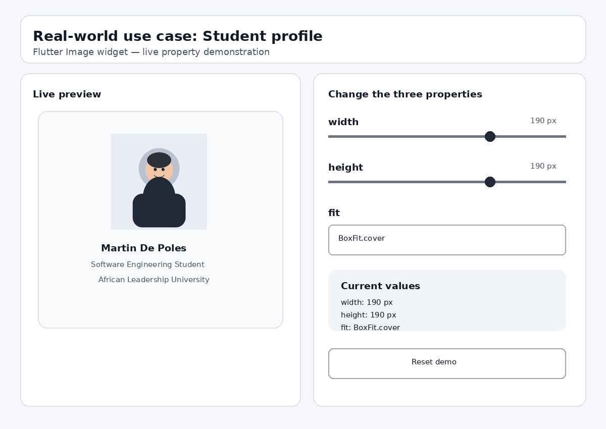

# Image Widget Demo

Small Flutter project for a presentation in classroom, about the Flutter widget `Image`.

## Real-world use case

Student photo is an image of the app. It allows the presenter to alter 3 properties of the `Image.asset` and instantly view the changes.

## The three properties

2. `width` — sets the width of the image.
2. `height` — sets the height of the image.
3. `fit`: Specifies the way the image is scaled to fit the cell it is placed in.

## Run the project

In Android Studio or VS Code, open this folder.
Ensure that Flutter is installed and configured.
3. Execute flutter pub get command.
4. Start an Android Emulator or connect to an Android device.
5. Run `flutter run`.

It is a local image asset based project, so that the demo will not require internet connection.

## Presentation demo

Change `width` and `height` with the sliders. To change the value of fit, use the fit dropdown, for example to use BoxFit.cover.

To explain, for the presentation:
- the initial value of the property; and
- any changes which are occurring on the screen;
- for what reason might a developer want to change that property.

## Final UI

## Source

The implementation follows Flutter's official `Image` widget API and uses `Image.asset` with a local asset.
